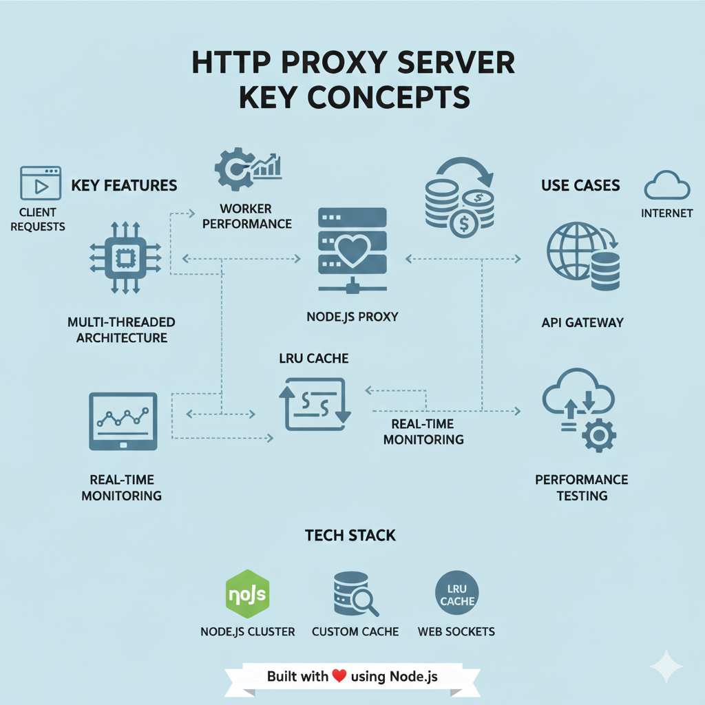

# Multithreaded Proxy Web Server with LRU Cache

Repo: https://github.com/Ramanand-tomar/Multithreaded-Proxy-web-server-with-LRU-cache

Overview
---------
This project is a lightweight, multi-process HTTP proxy server built with Node.js. It uses the Node.js cluster module to run a worker per CPU, and implements an in-memory LRU (Least Recently Used) cache to reduce repeated upstream requests. A built-in dashboard provides real-time visibility into cache contents, cache statistics (size, hit/miss ratio, memory estimate), and worker status (busy/available, request counts, last handler).

Key features
------------
- Multi-process (cluster) proxy server — scales to CPU cores
- LRU cache implemented with doubly linked list + hashmap for O(1) get/put/evict
- Real-time dashboard served from the same server:
  - Cache statistics (size, limit, hits/misses, memory usage)
  - LRU items visualization (LRU order, size, age)
  - Worker processes status (pid, requests, busy/available)
  - Test proxy form and quick test URLs
- Caching of successful (HTTP 200) responses only
- Response headers exposing cache and worker metadata (X-Cache, X-Worker-PID, X-Worker-ID, etc.)
- API endpoints:
  - GET /api/cache-status — returns cache stats and LRU items
  - POST /api/clear-cache — clears the cache
  - GET (master on PORT+1) /api/workers-status — returns worker states
 

Why build this
---------------
- Useful for local development, testing caching behaviour and concurrency.
- Educational: demonstrates DSA (LRU) and system-level concepts (clustering, inter-process messaging).
- Lightweight proxy for internal tools / demos where a CDN or full-featured reverse proxy is overkill.

Quick start
-----------
1. Clone:
   git clone https://github.com/Ramanand-tomar/Multithreaded-Proxy-web-server-with-LRU-cache
   cd "Multithreaded Server With LRU cache"

2. Install:
   npm install

3. Configure (optional):
   Edit `config.js` to change `PORT` and `CACHE_LIMIT`.

4. Run:
   npm start
   or
   node server.js

5. Open the dashboard:
   http://localhost:8080/dashboard/  (default; see config PORT)

6. Worker status API (master status server):
   http://localhost:8081/api/workers-status  (PORT + 1)

Proxy usage examples
--------------------
- Full URL proxy:
  - Browser: http://localhost:8080/http://jsonplaceholder.typicode.com/posts
  - The proxy accepts paths like `/http://example.com/path` and forwards them.
- Domain shorthand:
  - http://localhost:8080/jsonplaceholder.typicode.com/posts  (interpreted as http://jsonplaceholder.typicode.com/posts)
- From the dashboard:
  - Use the Test Proxy form or quick test buttons (JSONPlaceholder URLs included).

Headers exposed
---------------
When proxied, responses include extra headers to help debugging:
- X-Cache: HIT | MISS | BYPASS
- X-Worker-PID: the PID of the worker that handled the request
- X-Worker-ID: cluster worker id (if available)
- X-Cache-Size, X-Cache-Hits, X-Cache-Misses

LRU cache and DSA (how knowledge was applied)
---------------------------------------------
- The LRU cache uses:
  - A hashmap (Map) for O(1) key lookup.
  - A doubly linked list to maintain order of use and enable O(1) move-to-front and eviction.
- get/put operations are constant time (O(1)), preventing the cache from becoming a bottleneck at high QPS.
- Memory accounting:
  - The cache manager estimates memory usage by summing byte lengths of keys and values and a small per-node overhead.
- The design choices (data structures and complexity trade-offs) were driven by performance and predictability requirements.

Project structure (important files)
-----------------------------------
- server.js — cluster master & worker bootstrap, static dashboard serving, dashboard APIs
- proxyHandler.js — proxy logic, request parsing, caching integration
- lruCache.js — LRU cache implementation (Node + value + lastAccessed)
- cacheManager.js — shared cache instance + stats (hits/misses/memory)
- public/index.html, public/dashboard.js, public/dashboard.css — dashboard UI
- config.js — configuration (PORT, CACHE_LIMIT, etc.)

APIs
----
- GET /api/cache-status
  - Returns: { size, limit, hitRatio, memoryUsage, totalBytes, hits, misses, totalRequests, keys: [ { key, size, lastAccessed } ] }
- POST /api/clear-cache
  - Clears the in-memory cache; returns success JSON
- GET (status server on PORT+1) /api/workers-status
  - Returns worker metadata (id, pid, status, requests)

Testing notes
-------------
- Use the dashboard to exercise endpoints and watch cache behavior.
- Repeated requests to the same URL should show MISS on first request and HIT on subsequent requests (dashboard and response headers reflect this).
- The dashboard polls APIs periodically for near-real-time updates; worker stats are exposed by the master on PORT+1.

Potential improvements
----------------------
- Persist cache to disk or Redis to survive restarts.
- Add TTL support per-entry.
- Add WebSocket for push updates instead of polling.
- Add auth for the dashboard and rate-limiting for the proxy.
- Add Prometheus metrics and logging aggregation for production use.

Contributing
------------
PRs and issues welcome. If you make improvements, please include tests and update README accordingly.

License
-------
MIT

Contact
-------
Repo: https://github.com/Ramanand-tomar/Multithreaded-Proxy-web-server-with-LRU-cache
Author: Ramanand Tomar
